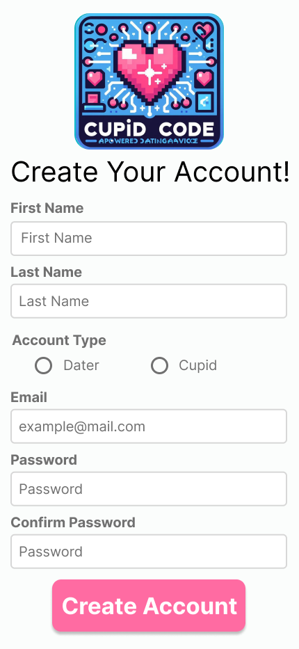
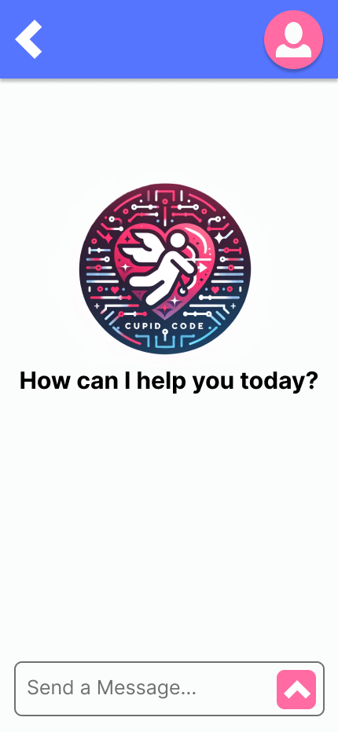
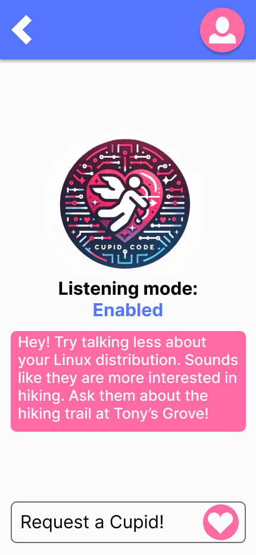
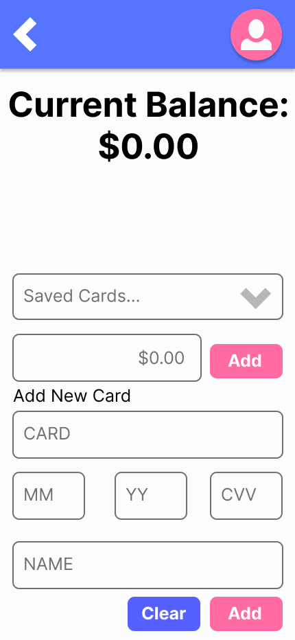
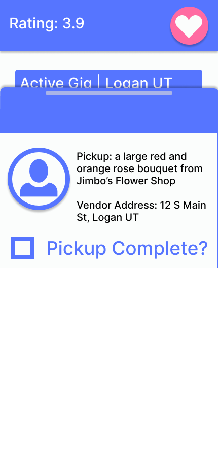
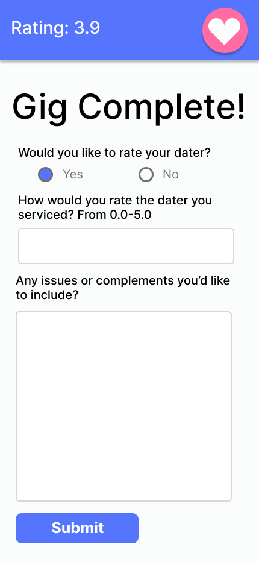
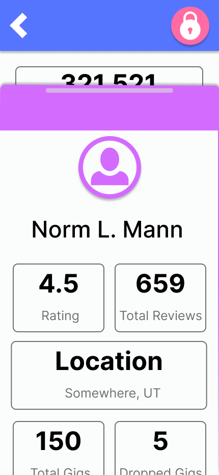
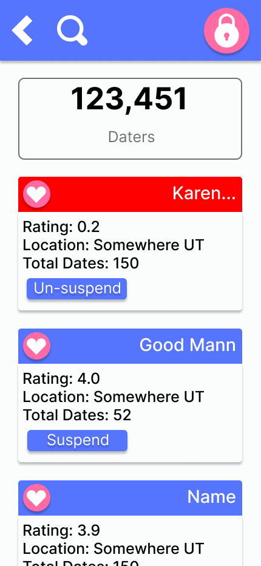
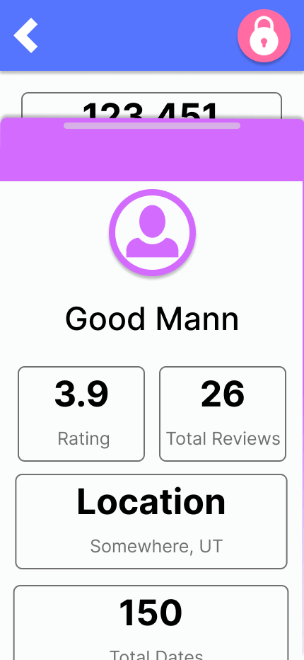

# **Cupid Code**

# **Low Level Design Document**

Team 2

Sprint Leader: Nate Stott

Sprint Followers: Emma Wright, Brighton Ellis, Nate McKenzie, Eric DeBloois, Daniel Barfuss, Brandon Herrin

02/08/24

<!--toc:start-->
- [**Cupid Code**](#cupid-code)
- [**Low Level Design Document**](#low-level-design-document)
    - [Sub-team Members](#subteam-members)
      - [Frontend Team Members](#frontend-team-members)
      - [Middleend Team Members](#middleend-team-members)
      - [Backend Team Members](#backend-team-members)
    - [Sub-team Responsibilities](#subteam-responsibilities)
      - [Frontend team](#frontend-team)
      - [Middleend team](#middleend-team)
      - [Backend team](#backend-team)
    - [Team Conventions and Standards](#team-conventions-and-standards)
      - [Branching Conventions](#branching-conventions)
      - [Naming Conventions](#naming-conventions)
      - [Coding Standards](#coding-standards)
      - [Commenting Standards](#commenting-standards)
      - [Testing Standards](#testing-standards)
  - [Frontend Design](#frontend-design)
    - [Security](#security)
    - [UI](#ui)
    - [UX](#ux)
    - [Templates](#templates)
    - [Vue Router](#vue-router)
    - [Testing](#testing)
  - [Connecting Vue and Django](#connecting-vue-and-django)
      - [Poetry](#poetry)
      - [Vite Config](#vite-config)
      - [NPM](#npm)
      - [Serverside](#serverside)
        - [Files to Add](#files-to-add)
        - [Environment](#environment)
        - [Middleware](#middleware)
        - [In Server Settings](#in-server-settings)
        - [In Core views.py](#in-core-viewspy)
        - [In Core index.html](#in-core-indexhtml)
      - [Clientside](#clientside)
  - [Backend Design](#backend-design)
    - [Django Project Structure](#django-project-structure)
    - [URL Mapping](#url-mapping)
      - [static endpoints](#static-endpoints)
      - [dynamic endpoints](#dynamic-endpoints)
    - [Django Models](#django-models)
    - [Django Migrations](#django-migrations)
    - [Django Settings](#django-settings)
    - [Django Admin](#django-admin)
    - [Unit Tests](#unit-tests)
    - [Quick Tutorial on how to use the Django Rest Framework](#quick-tutorial-on-how-to-use-the-django-rest-framework)
    - [Pseudocode](#pseudocode)
<!--toc:end-->

-----------
### Subteam Members

#### Frontend Team Members

* Eric 
* Brighton 
* Brandon

#### Middleend Team Members

* Emma

#### Backend Team Members

* Nate Stott 
* Nate McKenzie 
* Daniel

-----------
### Subteam Responsibilities

#### Frontend team

* Security 
    * Validate all input and output
* UI (Clean looking)
    * Attractive to look at (keep people coming back)
* UX (Easy to use)
    * Intuitive design
    * Easy to navigate
    * What is happening is clear
* Django Templates (if needed)
* Interact with backend (requests)
    * Deal with timeouts
* Test on many browsers
    * Phone
    * Desktop

#### Middleend team

* work with both teams to ensure that the frontend and backend work together
* do work as requested by either team
  * a team could be falling behind and need help

#### Backend team

* Security
    * Django Admin
    * User Authentication
    * Validate all input and output
* Django models (database)
* Map URLs to views
* Django views (Communicate with frontend, responses)
    * 200
    * 404
* Create system APIs to call external APIs (easy to switch out)
* Django Migrations
* Django settings
* Unit tests

-----------
### Team Conventions and Standards

#### Branching Conventions

* Master 
  * what we are showing
* Hot Fixes 
  * quick fixes for master
* Releases 
  * the next version to be merged with master
* Development 
  * what we are working on
* Features 
  * new features for the development branch

#### Naming Conventions

How will we name our files, directories, variables, functions, classes, etc.?

lowerCamelCase for frontend/Vue
underscore_naming for backend/Django

#### Coding Standards

Our code should be clean and easy to read. Our code should tell a story. Here is how we will do that.

How will we name our variables?
  * Descriptive names
  * No single letter variables
  * No abbreviations
  * No numbers in names
  * No special characters in names other than _ to separate words

How will we format our code?
  * Use PEP8 for python
    * https://peps.python.org/pep-0008/
  * Use Vue Style Guide for Vue
    * https://v2.vuejs.org/v2/style-guide/?redirect=true
  * Use Django Style Guide for Django
    * https://docs.djangoproject.com/en/dev/internals/contributing/writing-code/coding-style/

How long can a line be?
  * No horizontal scroll
  * Every line should only do 1 thing normally

How long can a function be?
  * No limit but try to keep efficient (if it's too long, it's probably doing too much)
  * Every function should only do 1 thing normally
  * If it's doing too much, break it up
  * If it's doing too little, combine it

Will we use type hints?
  * Yes, for python

When nesting code how many levels deep can we go?
 * Ideally 3, but no more than 5
   * If it's more than 5, it's probably doing too much

#### Commenting Standards

When will we use comments?
  * Can make notes or use for testing, but clean up before merging
  * Can use TODO comments to mark things that need to be done

When will we use docstrings?
  * Ideally for every function and class
  * Should annotate the I/O of a function
  * Should annotate the purpose of a function or class

#### Testing Standards

Every function should have a test
  * Test with good and bad input
  * Test with edge cases

-----------
## Frontend Design

### Security
While a majority of the security will occur on the back, the front will do a little bit to ensure good data is being passed through. This will primarily be validating input and output. 
If there is bad input, we will visually inform the user of it with sufficient detail. This gives them the opportunity to change it and comply with our standards.
For example, if someone sends a chat to the AI, we will verify that there is no code injection or other malicious works inserted that would jeopardize the app. If bad input is given, we will inform the user (either via toast or other means) that something went wrong.
This will also be done for requests from the backend to make sure the given json is correct and valid. This can be done as simple as a check between who the frontend considers the user and who the backend considers the user. This could be done with ids or other unique keys.

The general psuedocode format + a psuedocode example for each to further display how each will be used.
``` javascript
async function get<Data>() {
  await the results from getting the profile 
    - this will make a call to the external apis
    - also will use the make requests function referenced in connection
  validate the results
    - if good, set the data to the on screen refs and rerender
    - if bad, put up error on screen for user (toast or otherwise)
}

async function getUser() {
  results = await makeRequest(`/api/user/${id}`)
  if results is valid (has all expected data)
    render the home page or profile page // This one can be used for both to ensure the user is logged in, real, and has their data
  if not
    render an error page saying something went wrong.
}

async function post<Data>() {
  check the data to be sent to ensure it is valid
  if valid 
   - await the request with the method "post" & a body with the information to send
   - navigate elsewhere OR rerender page
  if not valid
    - Display an error for the User (toast or otherwise)
}

async function updateUser() {
  if all necessary data has valid updates to it
    await makeRequest(`/api/dater/profile/`, 'post', 
    {
      dict of new data to be sent
    })
    rerender page or navigate back to home
  if data is not valid
    display an error about updating (a toast would make sense here)
}
```
Note that this will be the ONLY time there will be any calls made to the backend's APIs. The calls will use the URLs written and described in the backend section of the document. We are building it like this so that data is only called in a few, secure places. This will help narrow any data leaks or exploits that may come from these calls and help in the debugging process and maintain good, safe code.

### UI
#### Making accounts and logging in




#### Dater








#### Cupid






#### Manager






### UX
Crafting a seamless user experience is at the forefront of our app development mission. Through meticulous attention to detail, we are committed to ensuring a smooth and intuitive journey for every user. Our strategy centers around maintaining a cohesive and polished aesthetic, characterized by consistent color schemes that resonate throughout the app. Clear, easily discernible buttons and text inputs are prioritized, enhancing usability and reducing friction in navigation. Leveraging widely adopted formats and design conventions, we empower users to effortlessly engage with our app, fostering familiarity and ease of use. With our unwavering dedication to excellence in UX design, we are poised to deliver an exceptional digital experience that exceeds expectations and leaves a lasting impression.

### Templates
A majority of the frontend design will occur in View, but we will want to implement Django Templates for 2 cases. 
  Case 1: A django template is needed to connect the back to the front.
  Case 2: To protect the system, we can make the signing up/logging in its own Django app that will authenticate logging in so that you must be a verified user to use the rest of the app. This method will utilize the Django settings.py variables as well since you can tell it what the login page will be.

This won't deal with many of the external links since it will be an isolated app that's sole purpose is to add & validate users and redirect them based off of the type of account they are.

```html

<head>
  <style>
    /* Write inline styles here */
  </style>  
</head>
<body>
  <div>
    Welcome to Cupid Code landing page here
  </div>
  <button> Login </button>
  <button> Sign up </button>
</body>  
```
### Vue Router

The Vue app will live at URL `/app/`. The following pages will be available through the Vue Router.

| URL                | Notes                                |
|--------------------|--------------------------------------|
| /dater/home/       | dater homepage                       |
| /dater/chat/       | dater chat page                      |
| /dater/listen/     | dater listen page                    |
| /dater/balance/    | dater cash page                      |
| /dater/calender/   | dater calender page                  |
| /dater/profile/    | dater profile page                   |
| /cupid/home/       | cupid homepage                       |
| /cupid/gigs/       | cupid gigs                           |
| /cupid/balance/    | cupid balance                        |
| /cupid/profile/    | cupid profile                        |
| /manager/home/     | manager homepage                     |
| /manager/cupids/   | manager reports                      |
| /manager/daters/   | manager reports                      |


#### How the Router works
  This will all go into the App.vue file that is generated with the vue project.
  There might be an async function to decide what the routes will be but other than that this is all you need. Any other async calls should only be made in the components themselves. This is necessary for clean, readable code and security purposes so we don't have data living somewhere it isn't needed.
```javascript
<script>
  import ref and computed from vue;
  import all components from ./components;

  const routes = {
    "/<link>": AssociatedComponent,
    "/dater/home": DaterHome,
    "/dater/chat": DaterChat,
    etc...
  }

  const currPath = ref(windows location hash)

  eventListener("hashchange", () => {
    change currPaths value to windows location hash
  }) // This will run everytime it's changed to ensure it's correct.

  const currView = computed(() => {
    return routes[currpaths values first slice or '/']
  }) // Keeps track of what component to display

</script>

<template>
  <a href "#/<link>"> Relavent Name </a> 
  <a href "#/dater/home"> Home Page </a>
  <a href "#/dater/chat"> Chat with the AI! </a>
  etc..
  <component :is="currView" />
</template>

```

### Testing
These are some easy to implement methods to test our product before release:

1. **Unit Testing**: Begin by writing unit tests for individual components using frameworks like Jest or Mocha. Unit tests focus on testing isolated units of code, such as methods, computed properties, and components, ensuring they behave as expected.

2. **Component Testing**: Utilize Vue Test Utils to write tests for Vue components. These tests simulate user interactions and verify component behavior, such as rendering correctly, responding to user input, and emitting events.

3. **Integration Testing**: Test how different components work together by performing integration tests. Integration tests verify interactions between multiple components and ensure they integrate seamlessly within the application.

4. **Mocking**: Use mocks and stubs to isolate components or services from dependencies during testing. Mocking allows you to control the behavior of external dependencies and focus solely on testing the component or functionality in question.

By incorporating these testing practices into your Vue application development workflow, you can enhance its quality, reliability, and maintainability, ultimately delivering a robust and user-friendly experience to your users.

Unit Test Examples

*Note that these will live in their own file, likely called unitTest.js*
```javascript
import { mount } from '@vue/test-utils';
import GetBalance from '@/components/GetBalance.vue';

describe('GetBalance', () => {
  it('Display the original balance', async () => {
    const wrapper = mount(GetBalance);
    
    // Initially, the balance should mimic whats in the DB
    expect(wrapper.find('p').text()).toContain('Balance: <TesterBalance>');
    
    // Simulate a click on the button to add funds
    await wrapper.find('button').trigger('click');
    
    // After clicking, the balance should increase
    expect(wrapper.find('p').text()).toContain('Balance: <AddedBalance>');
  });
});
```

-----------
## Connecting Vue and Django

The main method we will be implementing will be using these tools: Vite, NPM, and Poetry. 
The frontend will be setup using npm for vite and vue. The backend using poetry for django.

#### Poetry

* Python 3.11+
* Django 5.0.2+
* Requests 2.31.0+
* Python-dotenv 1.0.1+

#### Vite Config

``` javascript
  plugins: [vue()],
  build: {
    manifest: true,
    rollupOptions: {
      input: "./src/main.js"
    },
    outDir: "../<server>/core/static/core"
  },
  base: "/static"
```
#### NPM

* Vue 3.3.11+
* Cookie 0.6.0+

#### Serverside

*Note: Before doing this, make sure you've started a vite project, django project and started at least one app in the django project*

##### Files to Add

* middleware.py in core app
* .env & .env.example in server directory
* templates/core folder with an index.html file in core app

##### Environment

* Add "ASSET_URL=http://localhost:5173" to both.
* Change the url to whatever the client is hosted on.
* Port 5173 is the default of vite so we'll be using that.

##### Middleware

* Add the asset middleware here
* We already have a written one

##### In Server Settings

* Import load_dotenv from dotenv (python-dotenv)
* Add a Debug check for asset middleware:
  * if DEBUG: MIDDLEWARE.append('core.middleware.asset_proxy_middleware')
  * Note: This is the middleware we added/wrote earlier

##### In Core views.py

* Import django.conf settings, json, and os
* Create the MANIFEST variable ({}) and setup loading the manifest.
* Create the index view
  * Create context:
    * asset_url: Use os to get the ASSET_URL from .env
    * debug: Use settings to get the debug
    * manifest: MANIFEST variable
    * js_file: Set to emptry string is in debug mode otherwise set to the manifest file
    * css_file: Follow same protocol as js_file.
  * return a render of the request, index.html, and the context.

##### In Core index.html

  * Generate a default, basic html file
  * Using Django Template, add an if/else statement to the head tag.
    * If debug
      * Two scripts. One points to /@vite/client and one points to src/main.js
        * These will point towards the asset_url from the view as well
      * The else will hold a link and a script using the css and js file from the manifest
  * Add an empty div with id "app" do the body tag. This will connect it to vue's "app" div in its generated index.html file.


#### Clientside

For running the server by default, you won't need to add anything. However, if you want to make some actual requests then this is where Cookie comes in. 
Add a utils folder in your src folder, and make a file called make_requests.js here. Here you'll write a function to send and receive json from the server.

Pseudocode
``` python
import cookie

makeRequest(uri, method, body):
  cookies = parse the cookies 
  options = create a dictionary of what to send to server
    method, headers, credentials
  if the method is post then turn the body into valid JSON

  result = fetch to serverside
  json = the result's json
  return the json
```
``` python
import requests, os, and an http response tool

assetMiddleware(next):
middleware(req):
  if there is a .in the path:
    set response to the asset url with full path
    return a response (consists of the response, content type, status, and reason)
  return next in chain
return middleware
```

-----------
## Backend Design

This section will include the following subsections:
  * Summary
  * Django Project Structure
  * URL Mapping
  * Django Models
  * Django Migrations
  * Django Settings
  * Django Admin
  * Unit Tests
  * Pseudocode

### Summary

The backend will be built using Django and the Django Rest Framework. As a result much of the needed security is already implemented. 
A majority of the work will be in the models, views, and serializers. The models will be the database, the views will be the API, and the serializers will be the conversion of the models to JSON and vice versa.
The frontend will communicate with the backend using HTTP GET and POST requests. The backend will respond with JSON data. This will be made easy by the Django Rest Framework.
Mapping what endpoints the frontend needs is helpful for the backend to know what to build. This will be done in the URL Mapping section.

#### Resources for the Backend
* Django Rest Framework Quickstart
  * https://www.django-rest-framework.org/tutorial/quickstart/
* Django Rest Framework API Reference
  * https://docs.djangoproject.com/en/5.0/ref/
* Django Rest Framework Serializers
  * https://www.django-rest-framework.org/api-guide/serializers/
* Django Rest Framework Views
  * https://www.django-rest-framework.org/api-guide/views/
* Django Rest Framework Permissions
  * https://www.django-rest-framework.org/api-guide/permissions/
* Django Rest Framework Authentication
  * https://www.django-rest-framework.org/api-guide/authentication/

### Django Project Structure

What will the project structure look like? What will the files be named? What will the directories be named?

* cupid_code/
  * cupid_code/ # main project directory
    * settings.py # main settings file
    * urls.py # main url file
    * wsgi.py # web server gateway interface
  * api/ # app for the api
    * migrations/ # migrations for the api app
    * admin.py # admin configuration
    * apps.py # app configuration
    * models.py # define the models
    * serializers.py # define the serializers
    * tests.py # write unit tests
    * urls.py # map the urls to the views
    * views.py # define and implement the views
  * manage.py # command line utility for managing the project
  * db.sqlite3 # the database

### URL Mapping

#### static endpoints

The following endpoints do not need any user data to be used.

| URL      | Method    | View Function | Notes                                                                                          |
|----------|-----------|---------------|------------------------------------------------------------------------------------------------|
| /        | GET       | welcome       | Welcome page                                                                                   |
| /login/  | GET, POST | login         | Login page, Send form                                                                          |
| /signup/ | GET, POST | signup        | Signup page, Send form                                                                         |
| /app/    | GET       | NA            | Vue Router takes over from here. Only if they are authenticated will they be able to call this |

Additional pages offered by [Vue Router](#vue-router)

#### dynamic endpoints

The following endpoints will need user data to be used. Authentication will be required for all of these endpoints.

| URL                             | Method | View Function         | Notes                                |
|---------------------------------|--------|-----------------------|--------------------------------------|
| /api/user/create/               | POST   | create_user           | Create user (use corresponding API)  |
| /api/user/<int:id>/             | GET    | get_user              | Get user data                        |
| /api/chat/                      | POST   | send_chat_message     | Send message                         |
| /api/chat/<int:id>/             | GET    | get_five_messages     | Return the last five chat messages   |
| /api/dater/calendar/<int:id>/   | GET    | get_calendar          | Get the dater's calendar (date list) |      
| /api/dater/rate/                | POST   | rate_dater            | Cupid rate Dater                     |
| /api/dater/ratings/<int:id>/    | GET    | get_dater_ratings     | Get list of dater's ratings          |
| /api/dater/avg_rating/<int:id>/ | GET    | get_dater_avg_rating  | Get dater's average rating           |
| /api/dater/transfer/            | POST   | dater_transfer        | Initiate transfer in                 |
| /api/dater/balance/<int:id>/    | GET    | get_dater_balance     | Get account balance                  |
| /api/dater/profile/<int:id>/    | GET    | get_dater_profile     | Get dater's profile                  |
| /api/dater/profile/             | POST   | set_dater_profile     | Set dater's profile                  |
| /api/cupid/rate/                | POST   | rate_cupid            | Dater rating a Cupid                 |
| /api/cupid/ratings/<int:id>/    | GET    | get_cupid_ratings     | Get list of cupid's ratings          |
| /api/cupid/avg_rating/<int:id>/ | GET    | get_cupid_avg_rating  | Get cupid's average rating           |
| /api/cupid/transfer/            | POST   | cupid_transfer        | Initiate transfer out                |
| /api/cupid/balance/<int:id>/    | GET    | get_cupid_balance     | Get account balance                  |
| /api/cupid/profile/<int:id>/    | GET    | get_cupid_profile     | Get cupid's profile                  |
| /api/cupid/profile/             | POST   | set_cupid_profile     | Set cupid's profile                  |
| /api/gig/create/                | POST   | create_gig            | Create gig                           |
| /api/gig/accept/                | POST   | accept_gig            | Accept gig                           |
| /api/gig/complete/              | POST   | complete_gig          | Complete gig                         |
| /api/gig/drop/                  | POST   | drop_gig              | Drop gig                             |
| /api/gig/<int:count>/           | GET    | get_gigs              | Return number of gigs around cupid   |
| /api/geo/stores/                | GET    | get_stores            | List of nearby stores                |
| /api/geo/activities/            | GET    | get_activities        | Nearby activities                    |
| /api/geo/events/                | GET    | get_events            | Nearby events                        |
| /api/geo/attractions/           | GET    | get_attractions       | Nearby attractions                   |
| /api/geo/user/<int:id>/         | GET    | get_user_location     | Get a user's location                |
| /api/manager/cupids/            | GET    | get_cupids            | Get a list of cupids                 |
| /api/manager/daters/            | GET    | get_daters            | Get a list of daters                 |
| /api/manager/dater_count/       | GET    | get_dater_count       | Manager reports                      |
| /api/manager/cupid_count/       | GET    | get_cupid_count       | Manager reports                      |
| /api/manager/active_cupids/     | GET    | get_active_cupids     | Manager reports                      |
| /api/manager/active_daters/     | GET    | get_active_daters     | Manager reports                      |
| /api/manager/gig_rate/          | GET    | get_gig_rate          | Manager reports                      |
| /api/manager/gig_count/         | GET    | get_gig_count         | Manager reports                      |
| /api/manager/gig_drop_rate/     | GET    | get_gig_drop_rate     | Manager reports                      |
| /api/manager/gig_complete_rate/ | GET    | get_gig_complete_rate | Manager reports                      |
| /api/manager/suspend/           | POST   | suspend               | suspend cupid / dater                |
| /api/manager/unsuspend/         | POST   | unsuspend             | unsuspend cupid / dater              |
| /api/stt/                       | POST   | speech_to_text        | Convert speech to text               |
| /api/notify/                    | POST   | notify                | Send a message according to pref.    |

### Django Models
We will use the Django built in User model, but add roles to it. This comes with authentication functionality and the following fields. Details available in 
[Django docs](https://docs.djangoproject.com/en/5.0/ref/contrib/auth/#django.contrib.auth.models.User).

* username
* first_name
* last_name
* email
* password
* groups
* user_permissions
* is_staff
* is_active
* is_superuser
* last_login
* date_joined

Each model will correspond to a table. Bold denotes a primary key. For most tables,
this is the default id provided by Django. For certain one-to-one tables they will use that
relationship as their primary key. 

* Dater
    * **User : OneToOne Field (As provided by Django)**
    * Phone Number : Text Field (validate user input)
    * Budget : Decimal Field
    * Communication preferences : IntegerChoices
    * Profile Picture : Image Field 
    * Text available to AI
        * Description of self : Text Field
        * Dating strengths : Text Field
        * Dating weaknesses : Text Field
        * Interests : Text Field
        * Past dating experiences : Text Field
        * Type of nerd : Text Field
        * Relationship goals : Text Field
        * Degree of AI assistance : Integer Field
    * Common with Cupid
        * Cupid Cash Balance : Decimal Field
        * Location : Text Field (Containing geo coordinates) 
        * Average Rating : Decimal Field
        * Suspended : Boolean Field
* Cupid
    * **User : OneToOne Field (As provided by Django)**
    * Accepting Gigs : Boolean Field (Is cupid accepting gigs)
    * Total gigs completed : Integer Field
    * Total gigs failed : Integer Field
    * Payment : Text Field with payment info (encrypted) 
    * Status : Text Choices
    * Common with Dater
        * Cupid Cash Balance : Decimal Field
        * Location : Text Field (Containing geo coordinates) 
        * Average Rating : Decimal Field
        * Suspended : Boolean Field
* Manager doesn't need anything more than a Django default user in the manager role
* Message
    * **id : Auto Field**
    * Owner : Foreign Key (User)
    * Text : Text Field
    * fromAI : Boolean Field (Indicates which side of the convo this message belongs to)
* Gig
    * **id : Auto Field**
    * Dater : Foreign Key
    * Cupid : Foreign Key
    * Quest : OneToOne Field
    * Status : Text Choices
    * DateTime of request : DateTime Field
    * DateTime of claim : DateTime Field
    * DateTime of completion : DateTime Field
* Quest (separate for modularity)
    * **Gig : *Established by OneToOne Field on Gig***
    * Budget : Decimal Field
    * Items Requested : Text Field 
    * Pickup location : Text Field (address or geolocation to get object from)
* Date
    * **id : Auto Field**
    * Dater : Foreign Key
    * Date & Time : DateTime Field
    * Location : Text Field (Containing geo coordinates) 
    * Description : Text Field
    * Status : Text Choices
    * Budget : Decimal Field
* Feedback
    * **id : Auto Field**
    * User : Foreign Key (can be a cupid or dater as both have a OneToOne user)
    * Gig : Foreign Key
    * Message : Text Field
    * Star Rating : Integer Field (bound to 1-5)
    * DateTime : DateTime Field 
* Payment Card
    * **User : Foreign Key**
    * Card Number : Text Field
    * CVV : Text Field
    * Expiration : Text Field
* Bank Account
    * **User : Foreign Key**
    * Routing Number : Text Field
    * Account Number : Text Field
    
    
### Django Migrations

* Dummy Daters
  * username:dater1, password:password, 200 cupid coin balance, budget of 50
  * username:dater2, password:password, 20 cupid coin balance, budget of 50
* Dummy Cupids
  * username:cupid1, password:password, 54 completed gigs, 12 failed
  * username:cupid2, password:password, 4 completed gigs, 16 failed
* Dummy Manager
  * username:manager, password:password
* Dummy messages
  * Create a few dummy conversation for each dater.
* Dummy Gigs
  * Unclaimed gig with a unique quest
  * Unclaimed gig with a unique quest
  * Claimed gig
* Dummy Dates
  * A dummy location, date is june 17th, so it will never come during this semester.
* Feedback
  * A couple positive reviews for each cupid
  * A couple negative reviews for each cupid
  * A couple positive reviews for each dater
  * A couple negative reviews for each dater

### Django Settings

The settings.py file is used to apply settings to the entire Django project. Here are the current additions to the settings.py file that are included beyond the base settings:

**Admin Allowed in INSTALLED_APPS**

The INSTALLED_APPS lists Django applications that are enabled in this project. To include the ability to have admins, this app is included in the list:

`django.contrib.admin`


### Django Admin

The Django admin site adds the possibility to have admin accounts with levels of management and control. The main functions this account can provide are the following:
* Easy creation, management, and deletion of user accounts
* Easy creation, management, and deletion of data
* Easy adjustment to permissions on user accounts
* Ability to export data (if needed)
* Logging and history of changes made to data

There are some concerns with the admin site and admin accounts. These include:
* Security concerns if an admin account is compromised (bad actor would have access to admin tools)
* Heavy resource usage when modifying accounts or data

To address these concerns, admins may be enforced to have strong passwords (12+ characters, including special characters, numbers, and a mix of lower and upper case characters). Then admin accounts may be used during times when the software experiences the least amount of activity to do intensive work (except for emergencies).


### Unit Tests

We will create unit tests to ensure that the software performs as expected. We will also ensure that security measures are in place to prevent improper usage of the software and protect user data, including Personal Identifiable Information (PII). 

Check the following Pseudocode section for `tests.py`, which contains planned unit tests.

* Django debug toolbar will be used to monitor the performance of the software and to identify any potential issues.
  * https://django-debug-toolbar.readthedocs.io/en/latest/


#### Quick Tutorial on how to use the Django Rest Framework

* Create a new app in the project
``` 
$ python manage.py startapp example
```

* In the project settings.py file, add the following to the INSTALLED_APPS list:
  * 'rest_framework'
  * 'example'
``` python
INSTALLED_APPS = [
    ...
    'rest_framework',
    'example',
    ...
]
```

* In the example/models.py file, create the models that will be used by the API
``` python

from django.db import models

class User(models.Model):
    username = models.CharField(max_length=100)
    email = models.EmailField()
    password = models.CharField(max_length=100)
    is_suspended = models.BooleanField()

```

* In the example/serializers.py file, create the serializers that will be used by the API (serializers are used to convert model instances to JSON and vice versa)
  * ReaderUserSerializer will be used to convert User instances to JSON
  * WriterUserSerializer will be used to convert JSON to User instances
``` python
from rest_framework import serializers
from .models import User

class ReaderUserSerializer(serializers.Serializer):
    id = serializers.IntegerField(read_only=True)
    username = serializers.CharField(max_length=100)
    email = serializers.EmailField()

class WriterUserSerializer(serializers.Serializer):
    username = serializers.CharField(max_length=100)
    email = serializers.EmailField()
    password = serializers.CharField(max_length=100)
    is_suspended = serializers.BooleanField()
```

* In the example/views.py file, create the views that will be used by the API
``` python
from rest_framework.decorators import api_view
from rest_framework.response import Response
from rest_framework import status
from .models import User
from .serializers import UserSerializer

@api_view(['GET'])
def user_list(request):
    users = User.objects.all()
    serializer = ReaderUserSerializer(users, many=True)
    return Response(serializer.data)
    
@api_view(['GET'])
def user_detail(request, pk):
    try:
        user = User.objects.get(pk=pk)
    except User.DoesNotExist:
        return Response(status=status.HTTP_404_NOT_FOUND)
    serializer = ReaderUserSerializer(user)
    return Response(serializer.data)
    
@api_view(['POST'])
def user_create(request):
    serializer = WriterUserSerializer(data=request.data)
    if serializer.is_valid():
        serializer.save()
        return Response(serializer.data, status=status.HTTP_201_CREATED)
    return Response(serializer.errors, status=status.HTTP_400_BAD_REQUEST)
```

* In the example/urls.py file, create the URLs that will be used by the API
``` python
from django.urls import path
from . import views

urlpatterns = [
    path('/user/', views.user_list),
    path('/user/<int:pk>/', views.user_detail),
    path('/user/create/', views.user_create),
]
```

* In the project's urls.py file, include the api's urls
``` python
from django.urls import path, include

urlpatterns = [
    ...
    path('/api/', include('api.urls')),
]
```


### Pseudocode

cupid_code/urls.py
``` python
path("", include("api.urls")),
path("api/", include("api.urls")),
path("admin/", admin.site.urls),
```

cupid_code/settings.py
``` python
# Very little will change from the settings.py initial configuration made on generation.
# Here are some adjustment(s)

INSTALLED_APPS = [
  ...
  'django.contrib.admin',
  rest_framework,
  'api',
  ...
]
```

api/urls.py
``` python

from django.urls import path
from . import views

urlpatterns = [
    path("/"), views.welcome, name="welcome"),
    path("/login/"), views.login, name="login"),
    path("/signup/"), views.signup, name="signup"),
    path("/app/"), views.app, name="app"),
    path("/api/user/create/"), views.create_user, name="create_user"),
    path("/api/user/<int:id>/"), views.get_user, name="get_user"),
    path("/api/chat/"), views.send_chat_message, name="send_chat_message"),
    path("/api/chat/<int:id>/"), views.get_five_messages, name="get_five_messages"),
    path("/api/dater/calendar/<int:id>/"), views.get_calendar, name="get_calendar"),
    path("/api/dater/rate/"), views.rate_dater, name="rate_dater"),
    path("/api/dater/ratings/<int:id>/"), views.get_dater_ratings, name="get_dater_ratings"),
    path("/api/dater/avg_rating/<int:id>/"), views.get_dater_avg_rating, name="get_dater_avg_rating"),
    path("/api/dater/transfer/"), views.dater_transfer, name="dater_transfer"),
    path("/api/dater/balance/<int:id>/"), views.get_dater_balance, name="get_dater_balance"),
    path("/api/dater/profile/<int:id>/"), views.get_dater_profile, name="get_dater_profile"),
    path("/api/dater/profile/"), views.set_dater_profile, name="set_dater_profile"),
    path("/api/cupid/rate/"), views.rate_cupid, name="rate_cupid"),
    path("/api/cupid/ratings/<int:id>/"), views.get_cupid_ratings, name="get_cupid_ratings"),
    path("/api/cupid/avg_rating/<int:id>/"), views.get_cupid_avg_rating, name="get_cupid_avg_rating"),
    path("/api/cupid/transfer/"), views.cupid_transfer, name="cupid_transfer"),
    path("/api/cupid/balance/<int:id>/"), views.get_cupid_balance, name="get_cupid_balance"),
    path("/api/cupid/profile/<int:id>/"), views.get_cupid_profile, name="get_cupid_profile"),
    path("/api/cupid/profile/"), views.set_cupid_profile, name="set_cupid_profile"),
    path("/api/gig/create/"), views.create_gig, name="create_gig"),
    path("/api/gig/accept/"), views.accept_gig, name="accept_gig"),
    path("/api/gig/complete/"), views.complete_gig, name="complete_gig"),
    path("/api/gig/drop/"), views.drop_gig, name="drop_gig"),
    path("/api/gig/<int:count>/"), views.get_gigs, name="get_gigs"),
    path("/api/geo/stores/"), views.get_stores, name="get_stores"),
    path("/api/geo/activities/"), views.get_activities, name="get_activities"),
    path("/api/geo/events/"), views.get_events, name="get_events"),
    path("/api/geo/attractions/"), views.get_attractions, name="get_attractions"),
    path("/api/geo/user/<int:id>/"), views.get_user_location, name="get_user_location"),
    path("/api/manager/cupids/"), views.get_cupids, name="get_cupids"),
    path("/api/manager/daters/"), views.get_daters, name="get_daters"),
    path("/api/manager/dater_count/"), views.get_dater_count, name="get_dater_count"),
    path("/api/manager/cupid_count/"), views.get_cupid_count, name="get_cupid_count"),
    path("/api/manager/active_cupids/"), views.get_active_cupids, name="get_active_cupids"),
    path("/api/manager/active_daters/"), views.get_active_daters, name="get_active_daters"),
    path("/api/manager/gig_rate/"), views.get_gig_rate, name="get_gig_rate"),
    path("/api/manager/gig_count/"), views.get_gig_count, name="get_gig_count"),
    path("/api/manager/gig_drop_rate/"), views.get_gig_drop_rate, name="get_gig_drop_rate"),
    path("/api/manager/gig_complete_rate/"), views.get_gig_complete_rate, name="get_gig_complete_rate"),
    path("/api/manager/suspend/"), views.suspend, name="suspend"),
    path("/api/manager/unsuspend/"), views.unsuspend, name="unsuspend"),
    path("/api/stt/"), views.speech_to_text, name="speech_to_text"),
    path("/api/notify/"), views.notify, name="notify"),
]

```

api/models.py
``` python

from django.db import models
from django.contrib.auth.models import AbstractUser

class User(AbstractUser):
    class Role(models.TextChoices):
        DATER = 'Dater'
        CUPID = 'Cupid'
        MANAGER = 'Manager'

    role = models.CharField(choices=Role.choices, max_length=7)

class Dater(models.Model):
    user = models.OneToOneField(User, on_delete=models.CASCADE, primary_key=True)
    phone_number = models.CharField(max_length=10)
    budget = models.DecimalField(max_digits=10, decimal_places=2)
    communication_preference = models.IntegerField()
    profile_picture = models.ImageField()
    description = models.TextField()
    dating_strengths = models.TextField()
    dating_weaknesses = models.TextField()
    interests = models.TextField()
    past = models.TextField()
    nerd_type = models.TextField()
    relationship_goals = models.TextField()
    ai_degree = models.TextField()
    cupid_cash_balance = models.DecimalField(max_digits=10, decimal_places=2)
    location = models.TextField()
    average_rating = models.DecimalField(max_digits=10, decimal_places=2)
    suspended = models.BooleanField()

class Cupid(models.Model):
    class Status(models.IntegerChoices):
        OFFLINE = 0
        GIGGING = 1
        AVAILABLE = 2

    user = models.OneToOneField(User, on_delete=models.CASCADE, primary_key=True)
    accepting_gigs = models.BooleanField()
    gigs_completed = models.IntegerField()
    gigs_failed = models.IntegerField()
    payment = models.TextField()
    status = models.IntegerField(choices=Status.choices)
    cupid_cash_balance = models.DecimalField(max_digits=10, decimal_places=2)
    location = models.TextField()
    average_rating = models.DecimalField(max_digits=10, decimal_places=2)
    
class Message(models.Model):
    owner = models.ForeignKey(User, primary_key=True, on_delete=models.CASCADE)
    text = models.TextField()
    from_ai = models.BooleanField()

class Gig(models.Model):
    class Status(models.IntegerChoices):
        UNCLAIMED = 0
        CLAIMED = 1
        COMPLETE = 2
        DROPPED = 2

    dater = models.ForeignKey(Dater, on_delete=models.CASCADE)
    cupid = models.ForeignKey(Cupid, on_delete=models.CASCADE)
    quest = models.OneToOneField(Quest, on_delete=models.CASCADE)
    status = models.IntegerField(chioces=Status.choices)
    date_time_of_request = models.DateTimeField()
    date_time_of_claim = models.DateTimeField()
    date_time_of_completion = models.DateTimeField()

class Quest(models.Model):
    gig = models.OneToOneField(Gig, on_delete=models.CASCADE, primary_key = True)
    budget = models.DecimalField(max_digits=10, decimal_places=2)
    items_requested = models.TextField()
    pickup_location = models.TextField()
    
class Date(models.Model):
    dater = models.ForeignKey(Dater, on_delete=models.CASCADE)
    date_time = models.DateTimeField()
    location = models.TextField()
    description = models.TextField()
    status = models.TextField()
    budget = models.DecimalField(max_digits=10, decimal_places=2)

class Feedback(models.Model):
    user = models.ForeignKey(User, on_delete=models.CASCADE)
    gig = models.ForeignKey(Gig, on_delete=models.CASCADE)
    message = models.TextField()
    star_rating = models.IntegerField()
    date_time = models.DateTimeField()
    
class PaymentCard(models.Model):
    user = models.ForeignKey(User, on_delete=models.CASCADE)
    card_number = models.TextField()
    cvv = models.TextField()
    expiration = models.TextField()

class BankAccount(models.Model):
    user = models.ForeignKey(User, on_delete=models.CASCADE)
    routing_number = models.TextField()
    account_number = models.TextField()

```

api/serializers.py
``` python

from rest_framework import serializers

# Still learning how to use serializers

```

api/views.py
``` python

from rest_framework.decorators import api_view
from rest_framework.response import Response
from rest_framework import status
from .models import Dater, Cupid, Message, Manager, Gig, Quest, Date, Feedback, PaymentCard, BankAccount
from .serializers import DaterSerializer, CupidSerializer, MessageSerializer, ManagerSerializer, GigSerializer, QuestSerializer, DateSerializer, FeedbackSerializer, PaymentCardSerializer, BankAccountSerializer

def welcome(request):
    return render(request, "welcome.html")
    
def sign_up(request):
    if request.method == "POST":
        validate the form
        return redirect("/login/")
    else:
        return render(request, "sign_up.html")
        
def login(request):
    if request.method == "POST":
        username = request.POST.get("email")
        password = request.POST.get("password")
        user = authenticate(request, username=username, password=password)
        if user is not None:
            login(request, user)
            return redirect("/app/")
        else:
            return render(request, "login.html", {"message": "Incorrect Password"})
    else:
        return render(request, "login.html")

def create_user(request):
  for each profile data for user:
    create a variable = request.{specific data}

  dater = Dater(
    model_column = request.POST[matching variable]
  )

  dater.save()
  
  return redirect("/app/")


def get_user(request, id):
  user = {flag that identifies who the user is (Dater/Cupid/Manager)}.objects.get(id=id)

  response = user.json()

  return response

def send_chat_message(request):
  forward_message = request.{name of message in body}
  save forward_message to DB as Message

  response = {method call to send to external AI chat API}
  save response to DB as Message

  return response.json()

def get_five_messages(request, id):
  dater = Dater.objects.get(id=id)

  list_of_messages = Message.objects.filter(owner=id)

  ordered_most_recent_messages = reorder list_of_messages from newest to oldest

  list_of_messages = first five of ordered_most_recent_messages

  response = list_of_messages.json()

  return response

def get_calendar(request, id):
  dater = Dater.objects.get(id=id)

  calendar = Date.objects.filter(dater=id)

  response = calendar.json()

  return response

def rate_dater(request):
  dater_id = request.dater_id
  dater = Dater.get(id=dater_id)
  rating = request.POST["rating"]

  feedback = Feedback(
    user = rating.user,
    intervention_request = rating.intervention_request, 
    message = rating.message,
    star_rating = request.star_rating,
    datetime = rating.datetime, 
  )

  feedback.save()

  new_rating = avg_rating(rating, dater_id)
  dater.avg_rating = new_rating

  dater.save()

  return JsonResponse({'message': 'Rating has been submitted'})

def get_dater_ratings(request, id):
  dater = Dater.objects.get(id=id)

  ratings = Feedback.objects.get(user=id)
  
  response = ratings.json()

  return response

def get_dater_avg_rating(request, id):
  dater = Dater.objects.get(id=id)

  avg_rating = dater.avg_rating

  response = avg_rating.json()

  return response

def dater_transfer(request):
  dater_id = request.user_id
  card_on_file = Payment_Card.objects.get(user=dater_id)

  transfer_amount = request.transfer_amount
  
  result = way to transfer money from card(card_on_file, transfer_amount)

  dater.balance = dater.balance + result

  send result to company bank account

  dater.save()

  return JsonResponse({'message': 'Payment successful'})

def get_dater_balance(request, id):
  dater = Dater.objects.get(id=id)

  response = dater.balance.json()

  return response

def get_dater_profile(request, id):
  dater = Dater.objects.get(id=id)

  response = dater.json()

  return response

def set_dater_profile(request):
  dater_id = request.user

  dater = Dater.objects.get(dater_id)

  for each dater profile property sent in request:
    dater.property = profile property sent    

  dater.save()

  return JsonResponse({'message': 'Profile saved'})

def rate_cupid(request):
  cupid_id = request.cupid_id
  cupid = Cupid.get(id=cupid_id)
  rating = request.POST["rating"]

  feedback = Feedback(
    user = rating.user,
    intervention_request = rating.intervention_request, 
    message = rating.message,
    star_rating = request.star_rating,
    datetime = rating.datetime, 
  )

  feedback.save()

  new_rating = avg_rating(rating, cupid_id)
  cupid.avg_rating = new_rating

  cupid.save()

  return JsonResponse({'message': 'Rating has been submitted'}) 
  
def get_cupid_ratings(request, id):
  cupid = Cupid.objects.get(id=id)

  ratings = Feedback.objects.get(user=id)
  
  response = ratings.json()

  return response

def get_cupid_avg_rating(request, id):
  cupid = Cupid.objects.get(id=id)

  avg_rating = cupid.avg_rating

  response = avg_rating.json()

  return response

def cupid_transfer(request):
  cupid_id = request.cupid_id
  bank_account = Bank_Account.objects.get(user=cupid_id)

  transfer_amount = request.transfer_amount
  
  send transfer_amount to bank_account
  
  cupid.balance = dater.balance - transfer_amount

  cupid.save()

  return JsonResponse({'message': 'Deposit successful'})

def get_cupid_balance(request, id):
  dupid = Cupid.objects.get(id=id)

  response = cupid.balance.json()

  return response

def get_cupid_profile(request, id):
  cupid = Cupid.objects.get(id=id)

  response = cupid.json()

  return response

def set_cupid_profile(request):
  cupid_id = request.user

  cupid = Cupid.objects.get(cupid_id)

  for each cupid profile property sent in request:
    cupid.property = profile property sent    

  cupid.save()

  return JsonResponse({'message': 'Profile saved'})
  
def create_gig(request):
    
    dater_id = request.dater_id
    dater = Dater.get(id=dater_id)
    quest = request.quest
    
    gig = Gig(
        dater = dater,
        cupid = None,
        quest = quest,
        status = 0,
        date_time_of_request = request.date_time_of_request,
        date_time_of_claim = None,
        date_time_of_completion = None,
    )
    
    gig.save()
    
    return JsonResponse({'message': 'Gig has been created'})
  
def accept_gig(request):

    cupid_ip_address = request.META.get('REMOTE_ADDR')
    cupid_id = request.cupid_id
    cupid = Cupid.get(id=cupid_id)
    cupid.location = cupid_ip_address

    gig_id = request.gig_id
    gig = Gig.get(id=gig_id)
    cupid_id = request.cupid_id
    cupid = Cupid.get(id=cupid_id)
    
    gig.cupid = cupid
    gig.status = 1
    gig.date_time_of_claim = request.date_time_of_claim
    
    gig.save()
    
    return JsonResponse({'message': 'Gig has been accepted'})
    
def complete_gig(request):

    cupid_ip_address = request.META.get('REMOTE_ADDR')
    cupid_id = request.cupid_id
    cupid = Cupid.get(id=cupid_id)
    cupid.location = cupid_ip_address
    
    gig_id = request.gig_id
    gig = Gig.get(id=gig_id)
    
    gig.status = 2
    gig.date_time_of_completion = request.date_time_of_completion
    
    gig.save()
    
    return JsonResponse({'message': 'Gig has been completed'})
    
def drop_gig(request):

    cupid_ip_address = request.META.get('REMOTE_ADDR')
    cupid_id = request.cupid_id
    cupid = Cupid.get(id=cupid_id)
    cupid.location = cupid_ip_address
    
    gig_id = request.gig_id
    gig = Gig.get(id=gig_id)
    
    gig.status = 1
    gig.date_time_of_claim = None
    gig.cupid = None
    
    gig.save()
    
    return JsonResponse({'message': 'Gig has been dropped'})
    
def get_gigs(request, count):
    gigs = Gig.objects.all()[:count]
    
    response = gigs.json()
    
    return response
    
def get_stores(request):
    
    dater_ip_address = request.META.get('REMOTE_ADDR')
    dater_id = request.dater_id
    dater = Dater.get(id=dater_id)
    dater.location = dater_ip_address
    
    stores = method call to get stores
    
    response = stores.json()
    
    return response
    
def get_activities(request):
    
    dater_ip_address = request.META.get('REMOTE_ADDR')
    dater_id = request.dater_id
    dater = Dater.get(id=dater_id)
    dater.location = dater_ip_address

    activities = method call to get activities
    
    response = activities.json()
    
    return response
    
def get_events(request):
    
    dater_ip_address = request.META.get('REMOTE_ADDR')
    dater_id = request.dater_id
    dater = Dater.get(id=dater_id)
    dater.location = dater_ip_address
    
    events = method call to get events
    
    response = events.json()
    
    return response
    
def get_attractions(request):

    dater_ip_address = request.META.get('REMOTE_ADDR')
    dater_id = request.dater_id
    dater = Dater.get(id=dater_id)
    dater.location = dater_ip_address
    
    attractions = method call to get attractions
    
    response = attractions.json()
    
    return response
    
def get_user_location(request, id):
    user = User.objects.get(id=id)
    
    location = user.location
    
    response = location.json()
    
    return response
    
def get_cupids(request):
    cupids = Cupid.objects.all()
    
    response = cupids.json()
    
    return response
    
def get_daters(request):
    daters = Dater.objects.all()
    
    response = daters.json()
    
    return response
    
def get_dater_count(request):
    dater_count = Dater.objects.count()
    
    response = dater_count.json()
    
    return response
    
def get_cupid_count(request):
    cupid_count = Cupid.objects.count()
    
    response = cupid_count.json()
    
    return response
    
def get_active_cupids(request):
    active_cupids = Cupid.objects.filter(status=2)
    
    response = active_cupids.json()
    
    return response
    
def get_active_daters(request):
    active_daters = Dater.objects.filter(status=2)
    
    response = active_daters.json()
    
    return response
    
def get_gig_rate(request):
    dates = Gig.objects.filter(status=1).count()
    gig_rate = Gig.objects.filter(status=1).count()
    
    rate = gig_rate / dates
    
    response = rate.json()
    
    return response

def get_gig_count(request):
    gig_count = Gig.objects.count()
    
    response = gig_count.json()
    
    return response
    
def get_gig_drop_rate(request):
    dates = Gig.objects.filter(status=3).count()
    gig_drop_rate = Gig.objects.filter(status=3).count()
    
    rate = gig_drop_rate / dates
    
    response = rate.json()
    
    return response
    
def get_gig_complete_rate(request):
    dates = Gig.objects.filter(status=2).count()
    gig_complete_rate = Gig.objects.filter(status=2).count()
    
    rate = gig_complete_rate / dates
    
    response = rate.json()
    
    return response
    
def suspend(request):
    user_id = request.user_id
    user = User.get(id=user_id)
    user.suspended = True
    
def unsuspend(request):
    user_id = request.user_id
    user = User.get(id=user_id)
    user.suspended = False
    
def speech_to_text(request):

    dater_ip_address = request.META.get('REMOTE_ADDR')
    dater_id = request.dater_id
    dater = Dater.get(id=dater_id)
    dater.location = dater_ip_address
    
    file = request.file
    text = api call to convert speech to text
    
    message = Message(
        owner = dater,
        text = text,
        from_ai = False,
    )
    
    ai_response = api call to convert text to speech
    ai_message = Message(
        owner = dater,
        text = ai_response,
        from_ai = True,
    )
    
    message.save()
    ai_message.save()
    
    return ai_message.json()
    
def notify(request):
    user_id = request.user_id
    user = User.get(id=user_id)
    message = request.message
    
        message = Message(
        owner = user,
        text = message,
        from_ai = True,
    )
    
    communication_preference = user.communication_preference
    
    if communication_preference == 1:
        send message to user's phone
    elif communication_preference == 2:
        send message to user's email
    elif communication_preference == 3:
        send message to user's phone and email
        
    message.save()
    
    return message.json()

```

api/tests.py
``` python

from django.test import TestCase
from unittest.mock import MagicMock

class APITestCase(TestCase):

    def test_sign_in(self):
        mock_request = MagicMock()
        mock_request.method = "POST"
        mock_request.POST.get = MagicMock(return_value="{
            "status": "success",
            "message": "User has been signed in"
            "code": 200
        }")
        response = sign_in(mock_request)
        self.assertEqual(response.status_code, 200)
        
        mock_request.POST.get = MagicMock(return_value="{
            "status": "failure",
            "message": "Incorrect Password"
            "code": 400
        }")
        response = sign_in(mock_request)
        self.assertEqual(response.status_code, 400)
        
    def test_login(self):
        mock_request = MagicMock()
        mock_request.method = "POST"
        mock_request.POST.get = MagicMock(return_value="{
            "status": "success",
            "message": "User has been logged in"
            "code": 200
        }")
        response = login(mock_request)
        self.assertEqual(response.status_code, 200)
        
        mock_request.POST.get = MagicMock(return_value="{
            "status": "failure",
            "message": "Incorrect Password"
            "code": 400
        }")
        response = login(mock_request)
        self.assertEqual(response.status_code, 400)
        
    def test_create_user(self):
        mock_request = MagicMock()
        mock_request.method = "POST"
        mock_request.POST.get = MagicMock(return_value="{
            "status": "success",
            "message": "User has been created"
            "code": 200
        }")
        response = create_user(mock_request)
        self.assertEqual(response.status_code, 200)
        
        mock_request.POST.get = MagicMock(return_value="{
            "status": "failure",
            "message": "User has not been created"
            "code": 400
        }")
        response = create_user(mock_request)
        self.assertEqual(response.status_code, 400)
    
    ...
```
